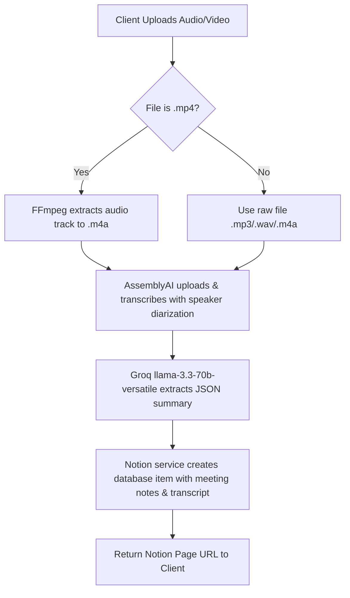

# MinuteForge AI

MinuteForge AI is a lightweight, database-free Node.js Express server that automates the processing of meeting recordings (audio or video) into formatted meeting minutes on Notion.

## Pipeline Flow



---

## Prerequisites

To run this project, you must have:
1. **Node.js** (v18 or higher recommended)
2. **FFmpeg** installed and accessible on your operating system (or the server will use the local `@ffmpeg-installer` binaries packaged with npm dependencies).

### Installing FFmpeg

#### **macOS**
Use Homebrew:
```bash
brew install ffmpeg
```

#### **Linux (Ubuntu/Debian)**
Use apt:
```bash
sudo apt update
sudo apt install ffmpeg
```

#### **Windows**
If you don't have FFmpeg globally installed, the project automatically falls back to utilizing precompiled binaries installed via the `@ffmpeg-installer/ffmpeg` npm dependency. If you prefer to install it globally:
1. Download from [FFmpeg Official Site](https://ffmpeg.org/download.html).
2. Extract the files and add the `bin/` directory path to your System Environment variables under **PATH**.

---

## Setup & Installation

1. **Clone the repository and navigate into it:**
   ```bash
   cd minuteforge-ai
   ```

2. **Install the dependencies:**
   ```bash
   npm install
   ```

3. **Configure Environment Variables:**
   Copy the example environment file:
   ```bash
   cp .env.example .env
   ```
   Open the newly created `.env` file and populate your respective API keys:
   ```env
   PORT=3000
   ASSEMBLYAI_API_KEY=your_assemblyai_api_key
   GROQ_API_KEY=your_groq_api_key
   NOTION_API_KEY=your_notion_integration_token
   NOTION_DATABASE_ID=your_notion_database_id
   ```

---

## Running the Application

### Development Mode (with hot-reloads)
```bash
npm run dev
```

### Production Mode
```bash
npm start
```

The server will start listening on the configured port (default `3000`).

---

## API Documentation

### **1. GET `/health`**
Verifies that the server is up and responsive.
- **Response (200 OK):**
  ```json
  {
    "status": "OK",
    "uptime": 124.52
  }
  ```

### **2. POST `/upload`**
Accepts a single audio or video file, processes it, and generates the Notion summary.
- **Request Format:** `multipart/form-data`
- **Field Name:** `file`
- **Allowed Formats:** `.mp3`, `.mp4`, `.m4a`, `.wav` (Max size: 200MB)
- **Response (200 OK):**
  ```json
  {
    "success": true,
    "notionUrl": "https://www.notion.so/..."
  }
  ```
- **Error Responses:**
  - **400 Bad Request:** Occurs if the file type is invalid or if no file is sent.
    ```json
    {
      "error": "Only .mp3, .mp4, .m4a, and .wav files are allowed"
    }
    ```
  - **500/504 Internal Error:** Detailed step-specific failure payload indicating which part of the pipeline crashed.
    ```json
    {
      "error": "[Transcription Failed]: AssemblyAI API Key is not configured."
    }
    ```

---

## Testing locally with curl

To send a test request to the server locally, run the following command in your terminal (replacing `test.mp3` with the path to your target file):

```bash
curl -X POST -F "file=@test.mp3" http://localhost:3000/upload
```