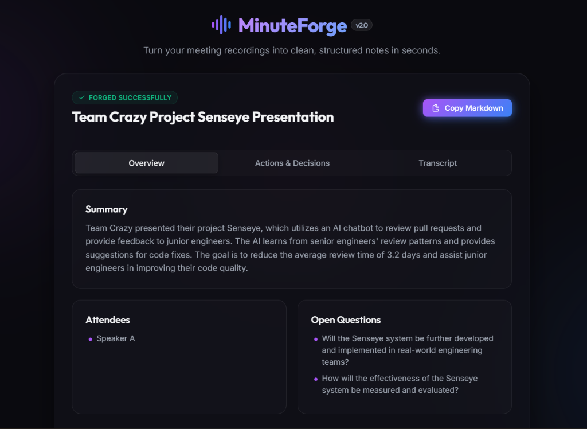
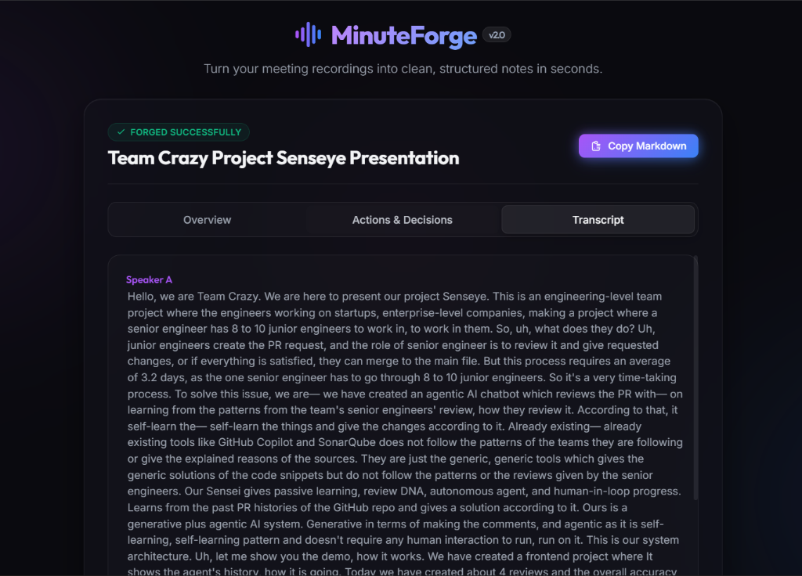
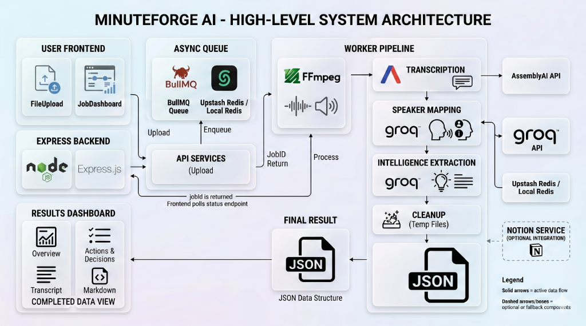

# 🎙️ MinuteForge AI

[](LICENSE)
[](CONTRIBUTING.md)
[](https://awesome.re)

MinuteForge AI is a high-performance, asynchronous meeting intelligence engine that converts audio and video recordings into clean, structured meeting minutes, actionable items, and resolved speaker transcripts in seconds.

Built with **Node.js, Express, BullMQ, and Upstash Redis**, it features speaker name resolution and metadata extraction powered by **Groq (Llama 3.3 70B)** and high-accuracy diarized transcription by **AssemblyAI**.

---

## 🎨 Visual Preview

### Interactive Dashboard View


### Diarized Speaker Transcript View


---

## 🚀 Key Features

*   **⚡ Async Processing Architecture**: Offloads CPU-intensive transcription and analysis to background workers via **BullMQ** and **Upstash Redis**. Say goodbye to HTTP request timeouts on large Zoom recordings.
*   **🔌 Zero-Config Fallback**: If local Redis is offline and no Upstash variables are configured, the engine **automatically falls back to an in-memory queue** so developers can test immediately out of the box.
*   **👥 Speaker Name Resolution**: Uses conversational context (greetings, introductions, direct addresses) to map generic diarization tags (`Speaker A`, `Speaker B`) to real attendee names (e.g., `Alice Chen`, `Bob Patel`).
*   **📆 ISO Deadline Parsing**: Resolves relative deadline mentions (e.g. "by next Friday", "end of month") to actual calendar dates (e.g., `YYYY-MM-DD`) using the dynamic meeting date context.
*   **🤝 Attributed Action Items**: Inspects surrounding context to map tasks to their respective owners. Handles ambiguity by outputting candidate splits (`Alice / Bob`) instead of defaulting to `Unassigned`.
*   **🧬 Levenshtein Deduplication**: Merges overlapping segments on long transcript chunks and removes duplicate decisions and duplicate tasks using a Normalized Levenshtein distance string similarity metric.
*   **💎 Premium Glassmorphic Web App**: Includes a dark-themed single page application with drag-and-drop file upload, real-time upload progress, progress timelines, checkable task grids, and one-click copy-to-clipboard markdown exporting.

---

## 📐 System Architecture



---

## 🛠️ Prerequisites

To run this project, you will need:
1.  **Node.js** (v18 or higher recommended)
2.  **Redis** (optional: falls back to in-memory mode if Redis is not running locally or configured via Upstash).
3.  **FFmpeg** (utilized for audio extraction from `.mp4` video files. Falls back to precompiled binaries automatically via `@ffmpeg-installer` if not installed globally on the system).

---

## ⚙️ Setup & Installation

1.  **Clone the repository:**
    ```bash
    git clone https://github.com/Sarasbari/minuteforge-ai.git
    cd minuteforge-ai
    ```

2.  **Install dependencies:**
    ```bash
    npm install
    ```

3.  **Configure Environment Variables:**
    Copy the example template:
    ```bash
    cp .env.example .env
    ```
    Open `.env` and fill in your credentials:
    ```env
    PORT=3000
    ASSEMBLYAI_API_KEY=your_assemblyai_api_key
    GROQ_API_KEY=your_groq_api_key
    
    # Optional Notion Configuration (retained for backward compatibility)
    NOTION_API_KEY=your_notion_integration_token
    NOTION_DATABASE_ID=your_notion_database_id
    
    # Optional Upstash Redis Configuration (defaults to Local Redis / In-Memory if omitted)
    UPSTASH_REDIS_URL=your_upstash_redis_url
    UPSTASH_REDIS_TOKEN=your_upstash_redis_token
    ```

---

## 🏃 Running the Application

### Development Mode (with hot-reloads)
```bash
npm run dev
```

### Production Mode
```bash
npm start
```
The server will start listening on port `3000`. Open your browser and navigate to **`http://localhost:3000`** to access the interface.

---

## 📡 REST API Documentation

### **1. POST `/upload`**
Enqueues a background job to process the uploaded file.
*   **Request Format:** `multipart/form-data`
*   **Field Name:** `file`
*   **Supported Formats:** `.mp3`, `.mp4`, `.m4a`, `.wav` (Max size: `500MB`)
*   **Response (202 Accepted):**
    ```json
    {
      "jobId": "1",
      "status": "queued"
    }
    ```

### **2. GET `/job/:id/status`**
Polls the execution status and retrieves result details.
*   **Status States:** `queued`, `transcribing`, `mapping_speakers`, `extracting`, `done`, `failed`.
*   **Response (200 OK - Done State):**
    ```json
    {
      "jobId": "1",
      "status": "done",
      "progress": 100,
      "result": {
        "extraction": {
          "title": "Weekly Sync",
          "summary": "The team reviewed project updates...",
          "attendees": ["Alice", "Bob"],
          "keyDecisions": ["Migrated queue backend to BullMQ"],
          "actionItems": [
            {
              "owner": "Alice",
              "task": "Configure Upstash Redis dashboard",
              "deadline": "2026-06-05"
            }
          ],
          "openQuestions": []
        },
        "transcript": "Speaker A: Hello Bob...",
        "speakers": [
          { "speaker": "Alice", "text": "Hello Bob...", "start": 0, "end": 1500 }
        ]
      },
      "error": null
    }
    ```

---

## 🧪 Testing Locally via CLI

You can submit files to the server using curl:
```bash
curl -X POST -F "file=@meeting.mp3" http://localhost:3000/upload
```
Using the returned `jobId`, poll the status endpoint:
```bash
curl http://localhost:3000/job/1/status
```

---

## 📝 License

Distributed under the MIT License. See `LICENSE` for more information.