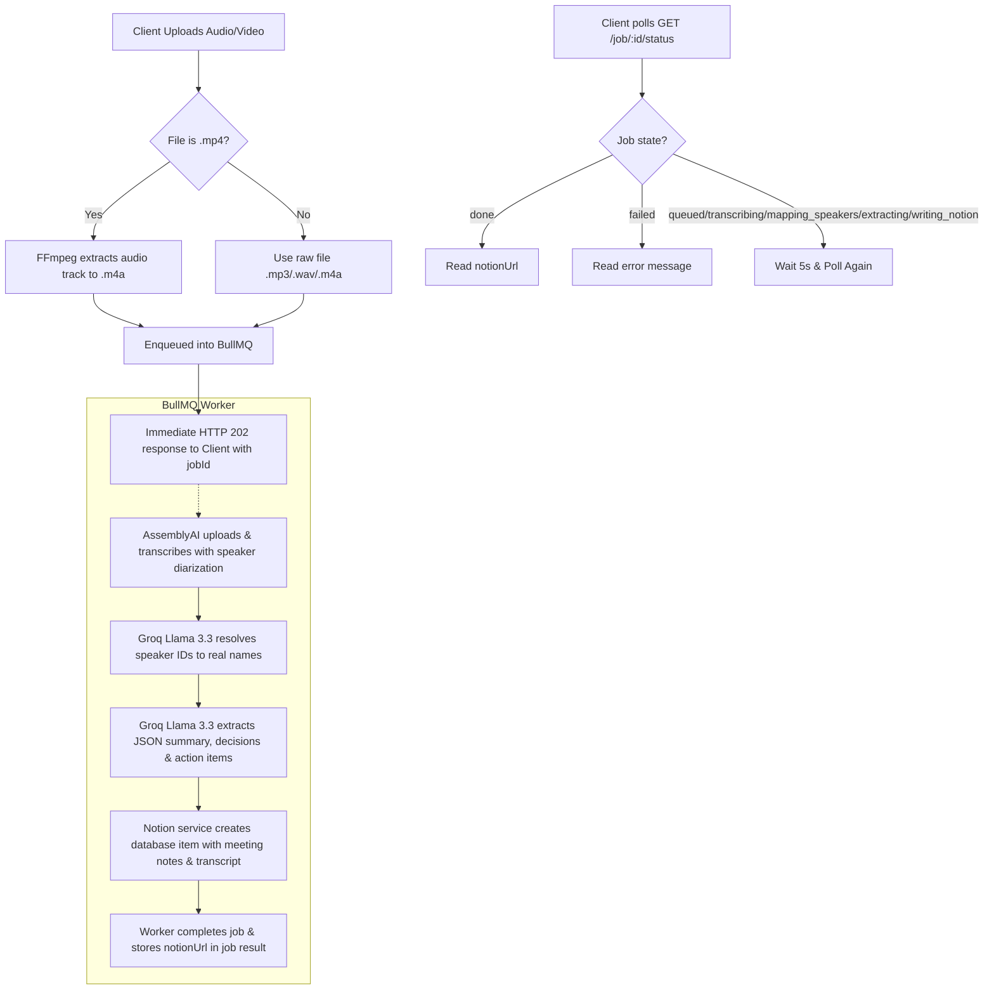

# MinuteForge AI

MinuteForge AI is a lightweight, database-backed Node.js Express application that automates the processing of meeting recordings (audio or video) into formatted meeting minutes on Notion.

Version 2 introduces an asynchronous pipeline using **BullMQ** and **Upstash Redis** to support long-running files without HTTP timeouts, speaker name inference from conversational cues via **Groq**, and enhanced prompt guidelines for action item ownership and ISO deadline parsing.

---

## Pipeline Flow



---

## Prerequisites

To run this project, you must have:
1. **Node.js** (v18 or higher recommended)
2. **Redis** (either Upstash Redis credentials, or a local Redis instance on port 6379 for fallback).
3. **FFmpeg** installed and accessible on your operating system (or the server will use the local `@ffmpeg-installer` binaries packaged with npm dependencies).

### Installing FFmpeg

#### **macOS**
Use Homebrew:
```bash
brew install ffmpeg
```

#### **Linux (Ubuntu/Debian)**
Use apt:
```bash
sudo apt update
sudo apt install ffmpeg
```

#### **Windows**
If you don't have FFmpeg globally installed, the project automatically falls back to utilizing precompiled binaries installed via the `@ffmpeg-installer/ffmpeg` npm dependency. If you prefer to install it globally:
1. Download from [FFmpeg Official Site](https://ffmpeg.org/download.html).
2. Extract the files and add the `bin/` directory path to your System Environment variables under **PATH**.

---

## Setup & Installation

1. **Clone the repository and navigate into it:**
   ```bash
   cd minuteforge-ai
   ```

2. **Install the dependencies:**
   ```bash
   npm install
   ```

3. **Configure Environment Variables:**
   Copy the example environment file:
   ```bash
   cp .env.example .env
   ```
   Open the newly created `.env` file and populate your respective API keys:
   ```env
   PORT=3000
   ASSEMBLYAI_API_KEY=your_assemblyai_api_key
   GROQ_API_KEY=your_groq_api_key
   NOTION_API_KEY=your_notion_integration_token
   NOTION_DATABASE_ID=your_notion_database_id
   UPSTASH_REDIS_URL=your_upstash_redis_url
   UPSTASH_REDIS_TOKEN=your_upstash_redis_token
   ```

---

## Running the Application

### Development Mode (with hot-reloads)
```bash
npm run dev
```

### Production Mode
```bash
npm start
```

The server will start listening on the configured port (default `3000`) and automatically launch the BullMQ background worker thread.

---

## API Documentation

### **1. GET `/health`**
Verifies that the server is up and responsive.
- **Response (200 OK):**
  ```json
  {
    "status": "OK",
    "uptime": 124.52
  }
  ```

### **2. POST `/upload`**
Accepts a single audio or video file, saves it to `/uploads`, and enqueues a background job.
- **Request Format:** `multipart/form-data`
- **Field Name:** `file`
- **Allowed Formats:** `.mp3`, `.mp4`, `.m4a`, `.wav` (Max size: 500MB)
- **Response (202 Accepted):**
  ```json
  {
    "jobId": "1",
    "status": "queued"
  }
  ```
- **Error Responses:**
  - **400 Bad Request:** Occurs if the file type is invalid, size limit exceeded, or if no file is sent.
    ```json
    {
      "error": "Only .mp3, .mp4, .m4a, and .wav files are allowed"
    }
    ```

### **3. GET `/job/:id/status`**
Retrieves the status and result of a background job.
- **Response (200 OK):**
  - **In Progress:**
    ```json
    {
      "jobId": "1",
      "status": "transcribing", // States: 'queued', 'transcribing', 'mapping_speakers', 'extracting', 'writing_notion'
      "progress": 30,
      "result": null,
      "error": null
    }
    ```
  - **Completed:**
    ```json
    {
      "jobId": "1",
      "status": "done",
      "progress": 100,
      "result": {
        "notionUrl": "https://www.notion.so/..."
      },
      "error": null
    }
    ```
  - **Failed:**
    ```json
    {
      "jobId": "1",
      "status": "failed",
      "progress": 50,
      "result": null,
      "error": "AssemblyAI transcription failed: 401 Unauthorized"
    }
    ```
- **Error Responses:**
  - **404 Not Found:** If the requested `jobId` does not exist or has expired.

---

## Testing locally with curl

To send a test request and monitor it:

1. **Upload the file:**
   ```bash
   curl -X POST -F "file=@test.mp3" http://localhost:3000/upload
   ```
   *Expected output:* `{ "jobId": "XYZ", "status": "queued" }`

2. **Poll the status endpoint (replace `XYZ` with the returned jobId):**
   ```bash
   curl http://localhost:3000/job/XYZ/status
   ```